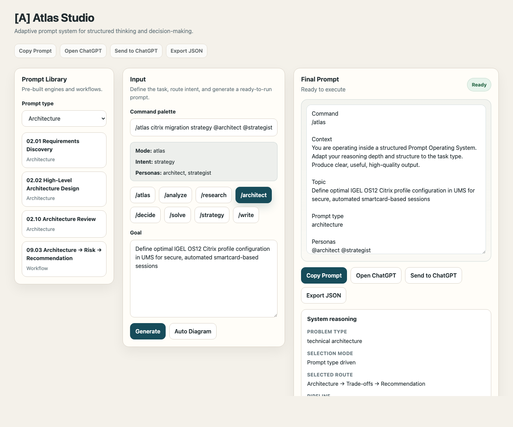

# [A] Atlas Studio

**Adaptive prompt system for structured thinking and decision-making.**

👉 **Live demo:** https://mcamner.github.io/atlas-one/

---

Atlas Studio is a **local-first adaptive prompt system** that turns raw intent into structured thinking workflows.

Instead of writing prompts ad-hoc, you:

* define intent
* select a reasoning mode
* generate a structured prompt
* copy or hand off cleanly to ChatGPT

---

**One input → adaptive prompt type → structured workflow → clean execution**

---

## Visual flow

```text
Input
  ↓
Route selection
  ↓
Workflow (analysis / architecture / strategy)
  ↓
Structured prompt pipeline
  ↓
ChatGPT execution
```

---

## UI preview

```text
┌───────────────────────────────────────────────────────┐
│ [A] Atlas Studio                                      │
│ Adaptive prompt system for structured thinking        │
│ and decision-making.                                  │
├───────────────────────────────────────────────────────┤
│ Prompt type                                           │
│ Architecture                                          │
│                                                       │
│ Quick actions                                         │
│ [ /atlas ] [ /research ] [ /write ] [ /strategy ]     │
│                                                       │
│ Goal                                                  │
│ Design a secure remote access architecture            │
│                                                       │
│ System reasoning                                      │
│ Requirements → Design Options → Recommendation        │
│                                                       │
│ Final Prompt                                          │
│ ChatGPT-ready structured prompt                       │
│                                                       │
│ [ Generate ] [ Copy Prompt ] [ Send to ChatGPT ]      │
└───────────────────────────────────────────────────────┘
```

---

## Screenshot

Interface preview from the GitHub Pages build:



## Try it

👉 https://mcamner.github.io/atlas-one/

No install. Runs in your browser.

---

### Why it matters

Most AI usage today is:

* unstructured
* inconsistent
* hard to repeat

Atlas Studio introduces:

* **structure** to thinking
* **consistency** to execution
* **repeatability** to workflows

---

### What you get

* **Adaptive prompt modes** — switch between analysis, architecture, research, strategy, decision, problem solving, execution, and writing
* **Quick actions** — choose `/atlas`, `/research`, `/write`, `/strategy`, and other modes from the interface
* **System reasoning preview** — see the selected problem type, route, pipeline, and rationale
* **Structured prompt library** — reusable prompt patterns for repeatable work
* **ChatGPT-ready handoff** — copy the final prompt and open ChatGPT in one action


---

This is not another prompt tool.
It’s a **system for thinking and execution.**

---

## What it does

Atlas Studio turns intent into structured AI workflows:

- **Adaptive prompt modes**  
  Maps the task to a useful reasoning style

- **Quick action controls**  
  Let you switch modes without rewriting the prompt manually

- **System reasoning preview**  
  Shows how a request flows through reasoning steps

- **Prompt library system**  
  Loads reusable prompts from `web/prompts.json`

- **Local-first execution**  
  Runs entirely on `127.0.0.1` — no external dependencies

- **ChatGPT handoff**  
  Copies the final prompt and opens ChatGPT for execution

---

## Example flow

```
User input:
"Design a secure remote access architecture"

↓

Prompt type selected:
Architecture

Route:
Requirements and Constraints → Design Options → Review and Recommendation

↓

Generated output:
ChatGPT-ready structured prompt
```

---

## Architecture

```
atlas-one/
├── src/              # Java server (API + static hosting)
├── web/              # UI (routing, prompts, visualization)
├── dist/             # Compiled artifacts
├── build_and_run.sh  # Local dev runner
├── package_mac_app.sh
└── run_mac.command
```

### Backend

- Java HTTP server
- Serves UI + API endpoints:
  - `/api/prompts`
  - `/api/health`

### Frontend

- Vanilla JS application
- Handles:
  - routing logic
  - prompt generation
  - UI state
  - local storage

---

## Getting started

### Requirements

- Java 17+

### Run locally

```bash
./build_and_run.sh
```

or:

```bash
./run_mac.command
```

Open:

```
http://127.0.0.1:8765
```

---

## Packaging (macOS)

```bash
./package_mac_app.sh
```

Creates a local macOS app bundle.

---

## How it works

1. User enters intent
2. User selects or confirms the prompt type
3. System updates reasoning, route, and workflow structure
4. Final prompt is generated
5. Output can be:
   - reviewed locally
   - copied and opened in ChatGPT

---

## Prompt system

Prompts are defined in:

```
web/prompts.json
```

This allows:

- versioned prompt strategies
- reusable workflows
- structured execution patterns

---

## Design principles

- **Local-first** — no cloud dependency
- **Structured thinking over raw prompting**
- **Repeatability over improvisation**
- **Separation of intent and execution**
- **Composable workflows**

---

## Roadmap

- Modular routing engine
- Advanced workflow editor
- Plugin system for prompt packs
- Multi-model support
- CLI integration
- Export/import of workflows
- Integration with external tools

---

## Use cases

- Architecture design
- Technical decision-making
- Problem analysis
- Structured research
- Workflow standardization
- Prompt engineering at scale

---

## Status

Early-stage, actively evolving.

---

## License

MIT

---

## Author

Mattias Camner  
IT Architect — building practical systems where infrastructure, automation, and usability work together

---

## Final note

Atlas Studio is not another prompt tool.

It’s an attempt to bring **structure, repeatability, and system thinking** into how we use AI.
